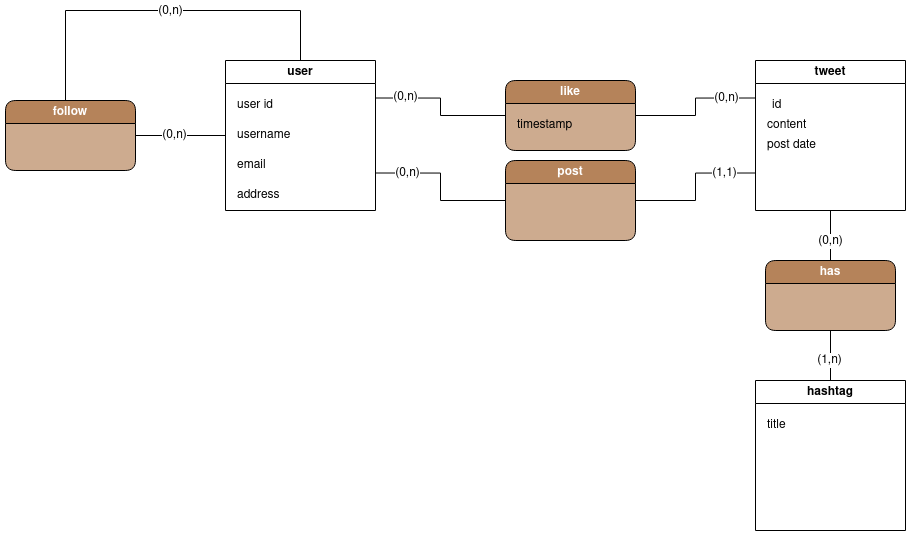
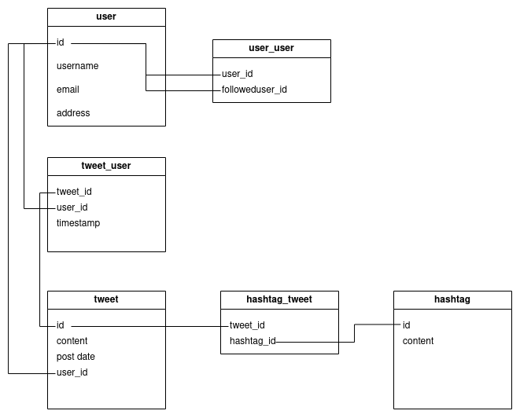
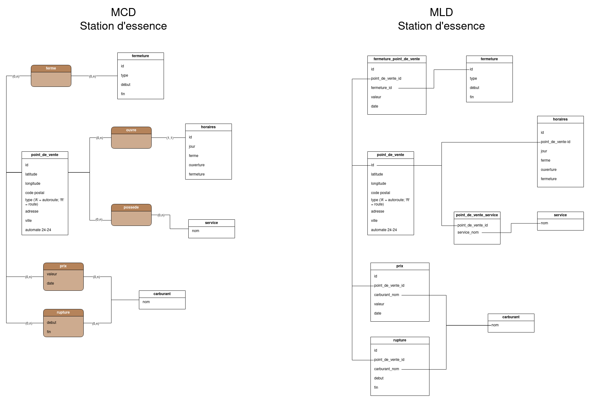

# MEMO - PHP/BDD

> Réponses aux questions du module PHP/BDD


## 1.1 MCD et MLD

**De manière général :**

**- Qu’est ce qu’un SGBD ?**
  
  Un système de gestion de base de données (SGBD) est le logiciel qui permet à un ordinateur de stocker, récupérer, ajouter, supprimer et modifier des données.

**- Qu’est-ce qu’un système d’information ?**

Ce sont l'ensemble des ressources et des moyens mis à disposition pour la collecte, le stockage, le traitement et la diffusion de la globalité des informations au sein d'une organisation, entre les différents acteurs concernés.


**- Qu’est-ce qu’une base de données ?**

Une base de données, BDD ou encore database en anglais, regroupe un ensemble d'informations qui est organisé pour être accessible, géré et mis à jour facilement par ses utilisateurs.


**- Citez les différences entre ces éléments.**

Un **système d'information** est un ensemble d'outils, de méthodes et de pratiques qui permettent de collecter, stocker, traiter et analyser des données pour fournir des informations utiles à des utilisateurs. Une **base de données**, quant à elle, est un ensemble organisé de données qui sont stockées sur un support de stockage.

Pour un MCD (Modèle Conceptuel de Données) :


**- Qu’est ce qu’un MCD et pourquoi est-ce que cela existe ?**

Un MCD (Modèle Conceptuel des Données) est un modèle de données qui représente les entités, les relations et les attributs d'un système. Il est utilisé pour décrire les données d'un système d'information et faciliter la compréhension des relations entre les différentes entités.


**- Comment représenter une entité ?**

Rectangle avec un titre en haut de la forme


**- Comment représenter une liaison entre des entités ?**

Pareil qu'une entité mais avec des bords arrondi, liant (sans flêcher) des entités entre-elles 


**- Où mettre les données qui composent nos entités ?**

Dans le rectangle fait pour l'entité


**- Quels sont les différents types de cardinalité possibles ? Où les placer dans notre schéma ?**

Les nombres minimums et maximums associés aux rélations. On les place dans la liaison. 

Ex.: 
(0, N)  = genre contient au min. 0 films et au max. illimité de films
(1,1)   = film a min 1 genre et max 1 genre (si on suppose que le fils est unigenre)

**[ GENRE ] --- (O, N) ---( CONTIENT ) --- (1,1) --- [ FILM ]**


**- Citer quelques bonnes pratiques de normalisation.**
-- Deux entités homogènes peuvent être fusionnées
-- Les attributs d'une association doivent dépendre directement des identifiants de **toutes** les entités en association
-- Une cardinalité minimale est toujours 0 ou 1 (et pas 2, 3 ou n) et une cardinalité maximale est toujours 1 ou n (et pas 2, 3, ..)


**- A quoi servent les clés primaires ?**

Les clés primaires dans un modèle de données relationnel (MCD) sont des colonnes ou des groupe de colonnes qui identifient de manière unique chaque enregistrement dans une table. Elles sont utilisées pour lier les données entre elles et pour garantir l'intégrité des données.


**Pour un MLD (Modèle Logique de Données) :**

**- Comment passer d'un MCD au MLD ? Que deviennent les associations ?**

Toutes les entités vont devenir une table

**Propriété**: Une propriété devient un attribut.

**Individu**: Un individu devient une relation (minimum en 3ème forme normale).

**Identifiant**: L'identifiant d'un individu devient la clé primaire de la relation correspondante.

**Association sans propriétés propres**

    Cardinalités (0,1) ou (1,1) vers (0,n) ou (1,n) : L'association disparaît et la clé de la relation relative à la cardinalité (0,n) ou (1,n) migre vers la relation relative à la cardinalité (0,1) ou (1,1). Cette clé est appelé "clé étrangère". La clé étrangère va se situer du côté de (0,1) ou (1,1), fait une réferencé à l'entité lié.

    Cardinalités (n) vers (n) = création de table intermédiaire


## 1.2 - Mise en pratique MCD et MLD


**MCD Twitter**




**MLD Twitter**




## 1.3 - Mise en pratique avec le dataset du module : le prix des stations essence




## 2.1 Initiation au SQL


**- Comment créer une base de données ?**
Dans le terminal: 

```sql
CREATE DATABASE nom_de_la_base_de_données;
```

Remplacez "nom_de_la_base_de_données" par le nom que vous souhaitez donner à votre base de données.

**- Comment faire un commentaire ?**

```sql
-- Ceci est un commentaire en SQL
```

Vous pouvez également utiliser la syntaxe des commentaires multi-lignes en fonction de votre système de gestion de base de données. Par exemple :

```sql
/* Ceci est un commentaire
sur plusieurs lignes */
```

**- Comment créer une table et des colonnes ?**
Pour créer une table avec des colonnes, vous pouvez utiliser la commande CREATE TABLE suivie du nom de la table et de la liste des colonnes avec leurs types de données. Voici un exemple générique :

```sql
CREATE TABLE nom_de_la_table (
    nom_colonne1 type_de_données,
    nom_colonne2 type_de_données,
    ...
);
```

Voici un exemple concret de création d'une table "utilisateurs" avec les colonnes "id", "nom" et "email" :

```sql
CREATE TABLE utilisateurs (
    id INT,
    nom VARCHAR(50),
    email VARCHAR(100)
);
```

Dans cet exemple, "id" est une colonne de type INTEGER, "nom" est une colonne de type VARCHAR avec une longueur maximale de 50 caractères, et "email" est une colonne de type VARCHAR avec une longueur maximale de 100 caractères.

**- Listez les types de données que vous utiliserez le plus souvent.**
Les types de données couramment utilisés sont :

    INTEGER (pour les nombres entiers)
    VARCHAR (pour les chaînes de caractères de longueur variable)
    DATE (pour les dates)
    DECIMAL (pour les nombres décimaux)
    BOOLEAN (pour les valeurs booléennes, vrai ou faux)
    TEXT (pour les textes de longueur variable)

**- Listez des contraintes utiles pour vos colonnes :**
Quelques contraintes utiles pour les colonnes sont :

    PRIMARY KEY (pour définir une clé primaire)
    FOREIGN KEY (pour définir une clé étrangère)
    UNIQUE (pour spécifier que la valeur d'une colonne doit être unique)
    NOT NULL (pour indiquer que la valeur ne peut pas être nulle)
    DEFAULT (pour spécifier une valeur par défaut)
    CHECK (pour définir une condition de vérification)

**- comment préciser qu'une valeur est obligatoire pour une colonne ?**
Pour préciser qu'une valeur est obligatoire pour une colonne, vous pouvez utiliser la contrainte NOT NULL lors de la création de la table. Par exemple :

```sql
CREATE TABLE my_table (
    column_name INT NOT NULL,
    ...
);
```

**- comment définir l'id d'une table ?**
Pour définir l'id d'une table, vous pouvez utiliser le type de données INTEGER et la contrainte PRIMARY KEY lors de la création de la table. Par exemple :

```sql
CREATE TABLE my_table (
    id INT PRIMARY KEY,
    ...
);
```

Il faut que l'id soit unique et pas null et il est courant d'utiliser un id auto-incrémenté pour assurer l'unicité des valeurs. ->
    id INT PRIMARY KEY AUTO_INCREMENT,


**- Comment préciser que la valeur d'une colonne doit être unique ?(pour une adresse email par exemple)**
Pour préciser que la valeur d'une colonne doit être unique, vous pouvez utiliser la contrainte UNIQUE lors de la création de la table. Par exemple, pour une colonne "email" contenant des adresses email :

```sql
CREATE TABLE my_table (
    email VARCHAR(255) UNIQUE,
    ...
);
```

Cela garantit que chaque adresse email dans la colonne "email" sera unique.

**- Comment insérer des données dans une table ?**
Pour insérer des données dans une table, vous pouvez utiliser la commande INSERT INTO suivie du nom de la table et des valeurs à insérer. Par exemple :

```sql
INSERT INTO my_table (column1, column2, ...)
VALUES (value1, value2, ...);
```

Vous devez spécifier les noms des colonnes et les valeurs correspondantes dans l'ordre approprié.

**- Comment récupérer les données insérées ?**
Pour récupérer les données insérées, vous pouvez utiliser la commande SELECT avec la clause FROM pour spécifier la table à interroger. Par exemple :

```sql
SELECT * FROM my_table;
```

Cela récupérera toutes les lignes et colonnes de la table "my_table". Vous pouvez également spécifier des conditions et des colonnes spécifiques pour affiner votre sélection.

**- Comment ne sélectionner qu'un certain nombre de résultats ?**
Pour sélectionner un certain nombre de résultats, vous pouvez utiliser la clause LIMIT dans votre requête SELECT. Par exemple :

```sql
SELECT * FROM my_table LIMIT 10;
```

Cela retournera les 10 premières lignes de la table "my_table". Vous pouvez modifier le nombre pour obtenir le nombre de résultats souhaité.

**- Comment trier les résultats ?**
Pour trier les résultats, vous pouvez utiliser la clause ORDER BY suivie du nom de la colonne par laquelle vous souhaitez trier. Par exemple :

```sql
SELECT * FROM my_table ORDER BY column_name;
```

Cela triera les résultats de la table "my_table" en fonction des valeurs de la colonne "column_name" par ordre croissant. Vous pouvez également spécifier l'ordre décroissant en utilisant "DESC" après le nom de la colonne.

**- Comment filtrer les données et chaîner les conditions de filtres ?**
Pour filtrer les données, vous pouvez utiliser la clause WHERE dans votre requête SELECT. Par exemple :

```sql
SELECT * FROM my_table WHERE column_name = value;
```

Cela retournera uniquement les lignes où la valeur de la colonne "column_name" correspond à "value". Vous pouvez également chaîner plusieurs conditions en utilisant les opérateurs logiques "AND" et "OR".

**- Comment filtrer une colonne avec une valeur commençant par un certain caractère ?**
Pour filtrer une colonne avec une valeur commençant par un certain caractère, vous pouvez utiliser l'opérateur "LIKE" avec le caractère joker "%" dans votre clause WHERE. Par exemple :

```sql
SELECT * FROM my_table WHERE column_name LIKE 'prefix%';
```

Cela retournera les lignes où la valeur de la colonne "column_name" commence par "prefix".


**- A quoi servent les INDEX ? Comment en créer ?**
Les INDEX servent à accélérer les opérations de recherche dans une table. Ils permettent de créer des structures de données optimisées pour un accès plus rapide aux enregistrements. Pour créer un INDEX, vous pouvez utiliser la commande CREATE INDEX suivie du nom de l'index et du nom de la table ainsi que des colonnes sur lesquelles vous souhaitez créer l'index. Par exemple :

```sql
CREATE INDEX index_name ON my_table (column1, column2, ...);
```

Cela créera un index nommé "index_name" sur les colonnes spécifiées de la table "my_table". Les INDEX peuvent être créés sur une ou plusieurs colonnes.

**- Comment créer une relation entre 2 tables ?**
Pour créer une relation entre deux tables, vous pouvez utiliser les clés primaires et les clés étrangères. Une clé étrangère dans une table fait référence à la clé primaire d'une autre table. Par exemple, pour créer une relation entre une table "orders" et une table "customers" où chaque commande est liée à un client, vous pouvez ajouter une colonne "customer_id" dans la table "orders" qui fait référence à la clé primaire "id" de la table "customers".

**- Comment sélectionner les données de plusieurs tables ?**
Pour sélectionner les données de plusieurs tables, vous pouvez utiliser la clause JOIN dans votre requête SELECT. La clause JOIN permet de combiner les lignes de deux ou plusieurs tables en fonction de leurs relations. Par exemple :

```sql
SELECT * FROM table1 JOIN table2 ON table1.column_name = table2.column_name;
```

Cela sélectionnera les données des tables "table1" et "table2" en combinant les lignes où les valeurs de la colonne "column_name" sont égales dans les deux tables.

**- Comment ne sélectionner que certaines colonnes et les renommer dans la liste de résultats ?**
Pour ne sélectionner que certaines colonnes et les renommer dans la liste de résultats, vous pouvez spécifier les noms des colonnes séparés par des virgules dans votre requête SELECT. Vous pouvez également utiliser l'opérateur "AS" pour renommer les colonnes. Par exemple :

```sql
SELECT column1 AS new_name1, column2 AS new_name2 FROM my_table;
```

Cela sélectionnera uniquement les colonnes "column1" et "column2" de la table "my_table" et les renommera respectivement en "new_name1" et "new_name2" dans la liste de résultats.

**- Comment supprimer une table et une base de données ?**
Pour supprimer une table, vous pouvez utiliser la commande DROP TABLE suivie du nom de la table. Par exemple :

```sql
DROP TABLE my_table;
```

Cela supprimera complètement la table "my_table" de la base de données.

Pour supprimer une base de données, vous pouvez utiliser la commande DROP DATABASE suivie du nom de la base de données. Par exemple :

```sql
DROP DATABASE my_database;
```

Cela supprimera complètement la base de données "my_database" et toutes les tables qui y sont associées.
